# FreshMart - Online Grocery Store 🛒
Welcome to FreshMart, your friendly online grocery store! 🌱✨ Whether you're looking for fresh produce, pantry essentials, or household items, FreshMart is here to make your grocery shopping experience seamless and enjoyable.

FreshMart is designed to offer you a simple, intuitive, and responsive UI for a smooth online shopping journey.

## Tech Stack 💻
- Frontend: HTML, CSS, JavaScript
- Design: Responsive UI design for all screen sizes
- Tools: Git, GitHub, Visual Studio Code

## Installation & Setup 🔧:
You can quickly get FreshMart running on your local machine with the following steps:

### 1. Clone the repository:

```bash
git clone https://github.com/yourusername/freshmart.git
 ```

### 2. Navigate to the project folder:

```bash
`cd freshmart`
 ```

### 3. Open the `index.html` file in your browser:

This will launch the FreshMart website locally for you to explore!


### Contribution ✨
We welcome contributions to FreshMart! If you'd like to improve the website, feel free to fork the repo, make changes, and submit a pull request. Here are some ways you can contribute:

- Report bugs or suggest features
- Add more products and improve UI
- Help optimize performance or add new features

## Contact 📬
If you have any questions or suggestions, feel free to reach out!

- Email: milan.shrestha1886@gmail.com
- GitHub: @MilanXrestha


## Thank You 🙏
Thank you for visiting FreshMart! We hope you enjoy your shopping experience. Happy browsing! 🎉

## Website Preview

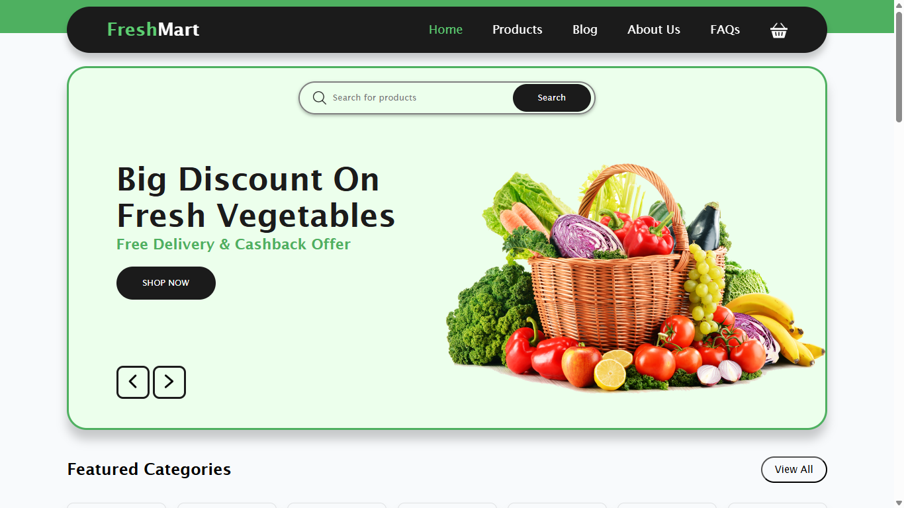

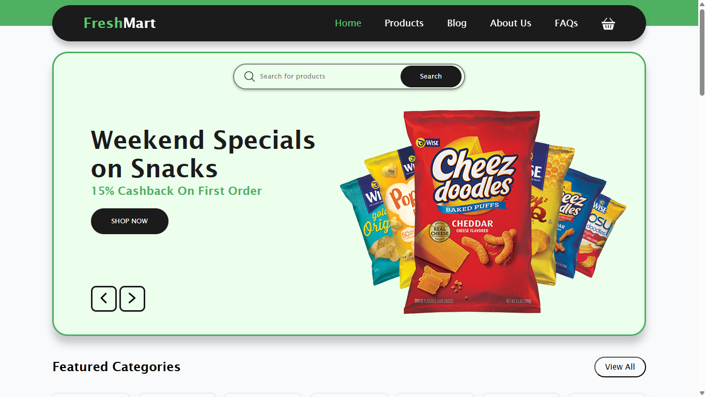

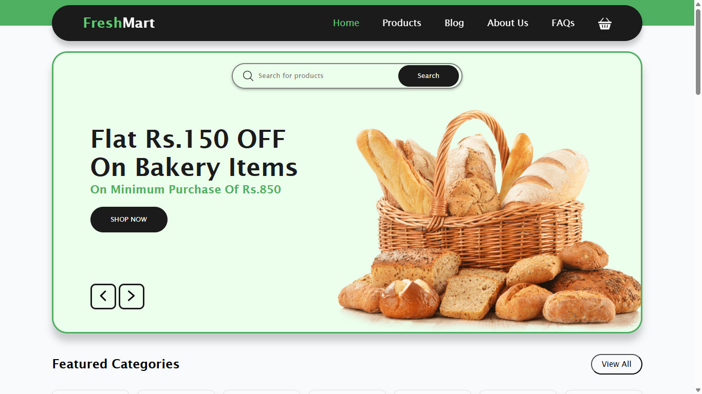

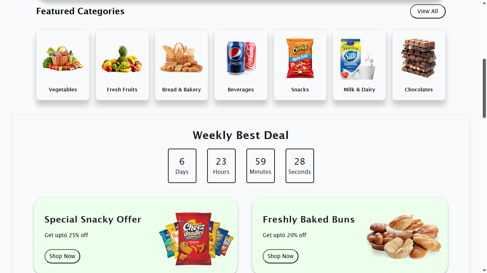

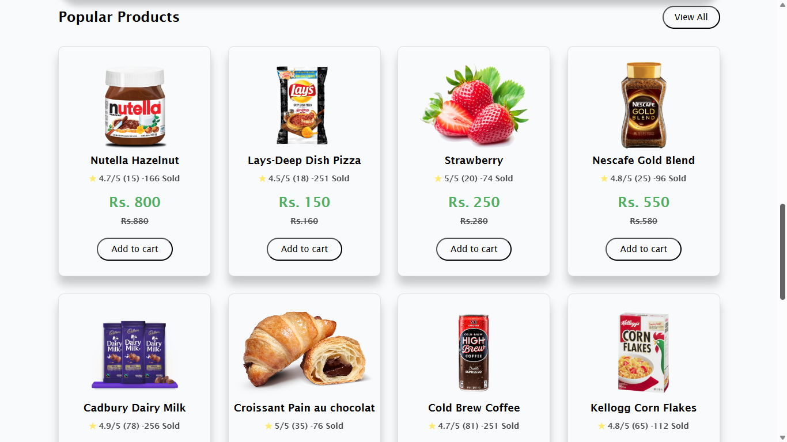

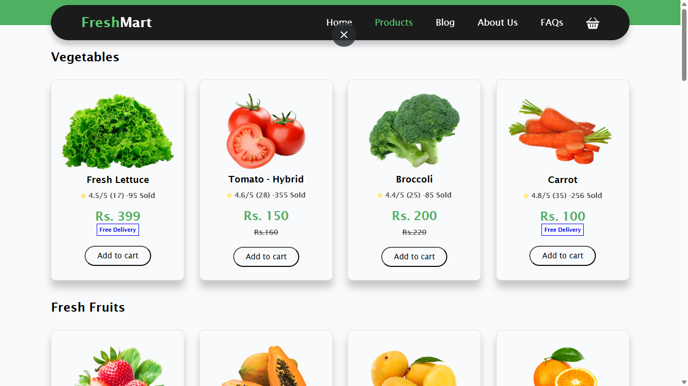

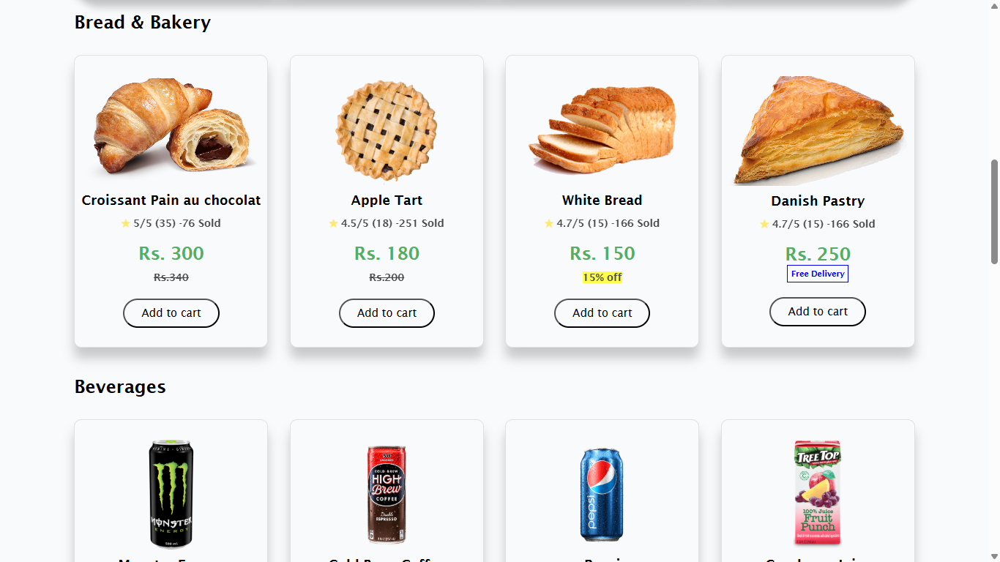

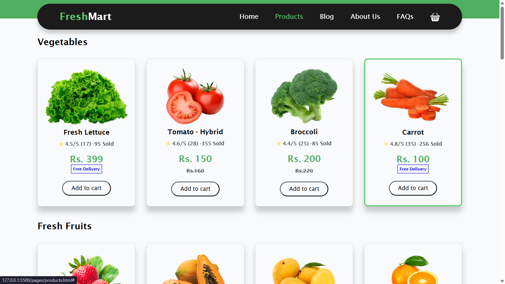

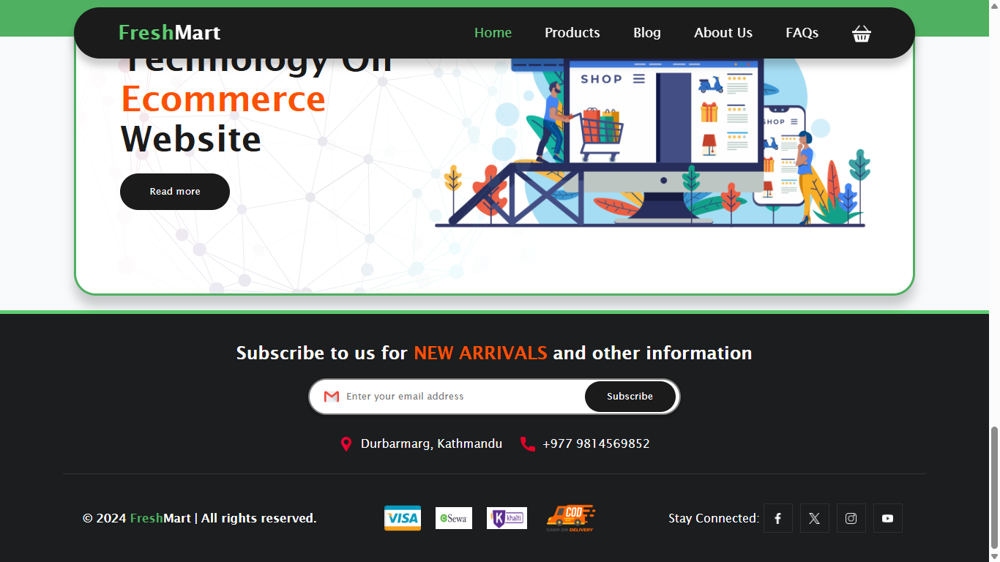

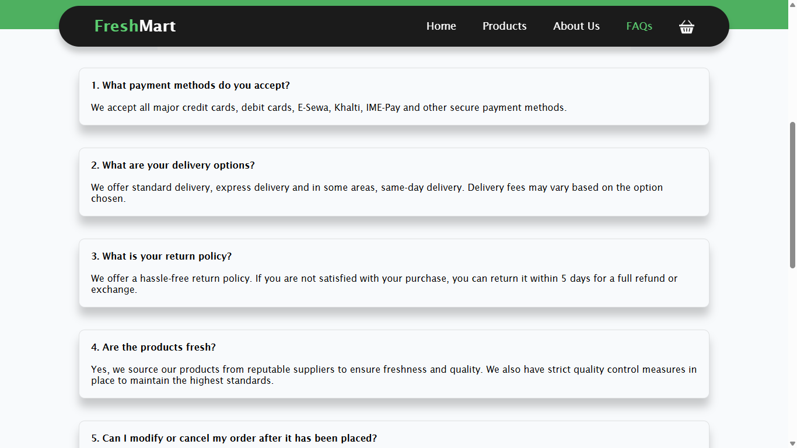

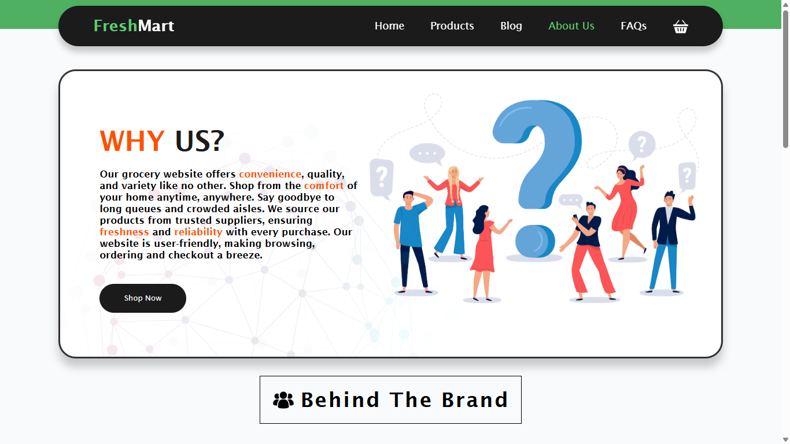
